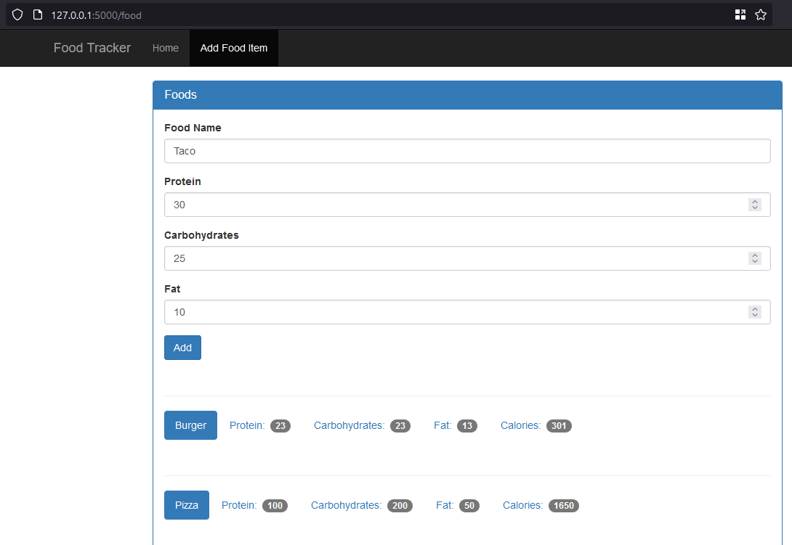

# food-tracker-flask-app

Food tracker app that allows you to add foods you consume everyday to track calories based on Python Flask. sqlite3 is being used for db. Each day totals the amount of protein, carbs, fat and calories which are autocalculated. You can add food items into the database which appears on drop down. There is a db provided in this repo for demo purposes. 

NOTE: If you get issues with the day not showing up after adding it, just go to "/view/20230905" - example for a date set to September 5, 2023. And just add some food. Working on resolving this bug. 

Need to install the following dependencies:
1. pip install flask
2. winget install -e --id SQLite.SQLite (Windows - need this to open up sqlite3 db and edit any tables, you can use a GUI app if you want)

# Home Page
Starting page for app where you can see overview of the app and dates tracked.

# Day Page
Click on "View Detail" to check the food consumed on the specific day

# Add Food Item
Click on the "Add Food Item" to add new foods into the database which will appear in the dropdown on the specific day you are adding food. 

